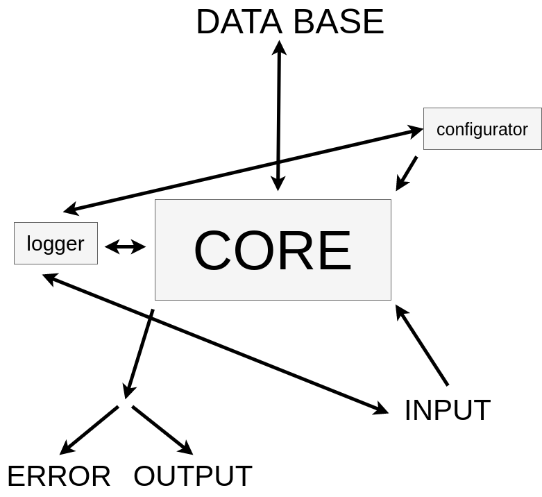
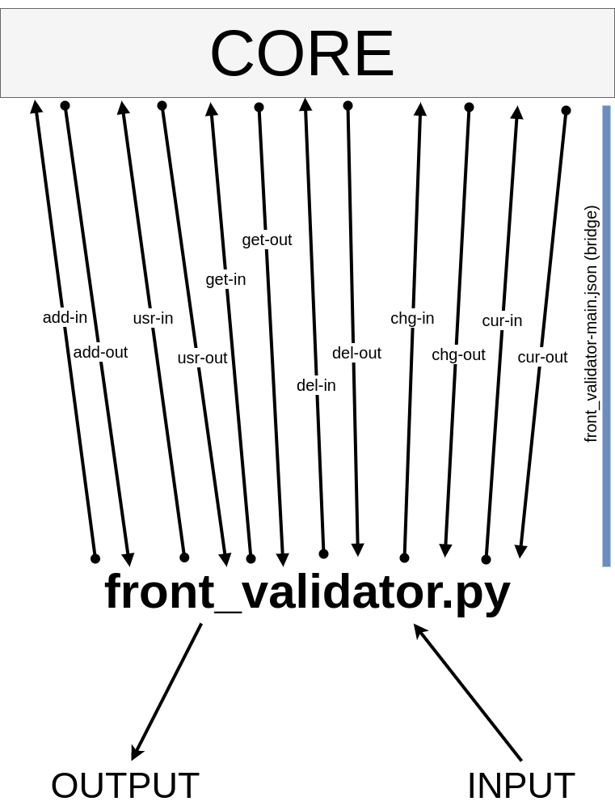
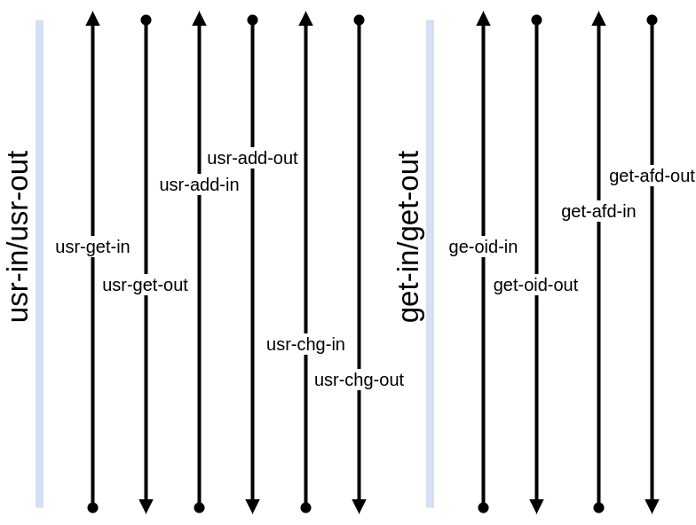

# BAF

___

Welcome to the BAF (Bourne Again Ferrum) documentation. 

##CONTENT

- General view
- Input
  - information 
  - syntax
  - commands
  - currency updater
- Output
- Configurator

___

##General view



___

##Input

### Information

Front validator is interface between user and core. It uses front_validator-main bridge to interact with core.





### Syntax

```
    baf-<command> -option1 -optionN
```

syntax of commands

```
    -option
```
basic option

```
    -option=value
```
option with value

###Commands

__baf-add__
- sum (s=float)
- tax (t=float (%))
- tax type (tt=b(before), a(after))
- interest (i=float)
- type (type=annuity loan (al), differentiated loan (dl), simple income (si), simple expense (se), regular income (ri), regular expense (re), deposit (d))
- length (l=integer)
- user id (uid=integer)
- add date (ad=DD.MM.YYYY)
- regularity (r=o (once), d (day), m (month))

(all commnads)

__baf-chg__
- sum (s=float)
- tax (t=float (%))
- tax type (tt=b(before), a(after))
- interest (i=float)
- type (type=annuity loan (al), differentiated loan (dl), simple income (si), simple expense (se), regular income (ri), regular expense (re), deposit (d))
- length (l=integer)
- user id (uid=integer)
- add date (ad=DD.MM.YYYY)
- regularity (r=o (once), d (day), m (month))
- new sum (ns=float)
- new tax (nt=float (%))
- new tax type (ntt=b(before), a(after))
- new interest (ni=float)
- new length (nl=integer)
- new add date (nad=DD.MM.YYYY)
- new regularity (nr=o (once), d (day), m (month))

(all commnads)

__baf-del__
- operation id (oid=integer)

(all commnads)

__baf-get__
- get type (gt=oid(operation id), afd(all for date))
- all for date:
  - user id (uid=integer)
  - date (d=DD.MM.YYYY)
  
  (all options)
			
- operation id:
  - sum (s=float)
  - tax (t=float (%))
  - tax type (tt=b(before), a(after))
  - interest (i=float)
  - type (type=annuity loan (al), differentiated loan (dl), simple income (si), simple expense (se), regular income (ri), regular expense (re), deposit (d))
  - length (l=integer)
  - user id (uid=integer)
  - add date (ad=DD.MM.YYYY)
  - regularity (r=o (once), d (day), m (month))
  
  (all options)

__baf-usr__
- action (add (add), chg (change), gui (get user id))
- add:
  - username (un=string)
  - currency (cu=usd, eur, rub)
  - first day of week (fd=m (Monday), s(Sunday))
  
(all options)
- change:
  - user id (id=integer) XOR username (un=string)
  - first day of week (fd=m (Monday), s(Sunday))
  - is active (ia=t (true)m f (false))
  - new username (un=string)

(all options)

- get:
  - username (un=string)
  
(all options)

__baf-cur__
- currency type (ct=cp (set currency point), cc (current currency))
- user id (uid=integer)
- new currency (nc=usd, eur, rub)

(all options)

__baf-run__

starts core, use from root user

###Currency rate updater (UPdate Currency)

```bash
  baf-upc ["usd": 0.0, "usd": 0.0, "rub": 0.0]
```

(0.0 is value for currency rate)

use json for input

___

## Output

Output splits into *error* and *output*.

```
  baf-<command>: reason
```

error


Core return JSON format output.

___

## Configurator

```bash
  baf-cfg
```

use from root user

- configurator has 3 modes:
1. Update core (add tables and columns to data base)
2. Install/reset core (drop and create data base)
3. Quit
<<<<<<< HEAD
=======

>>>>>>> v0.1.0d
